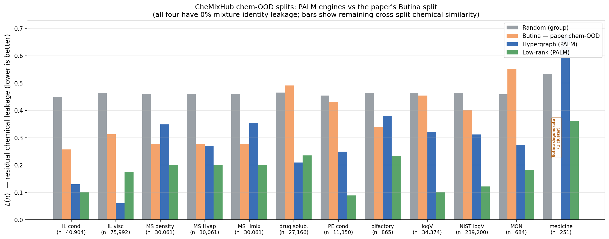
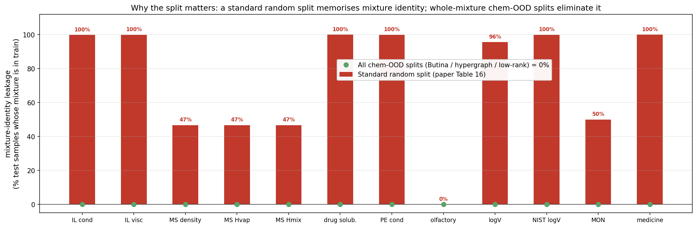
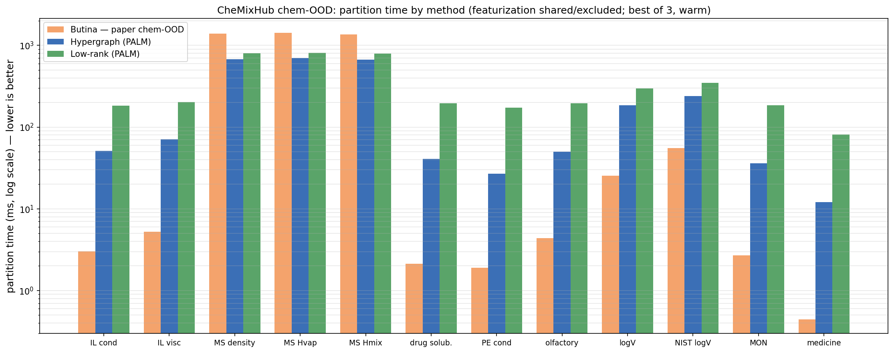
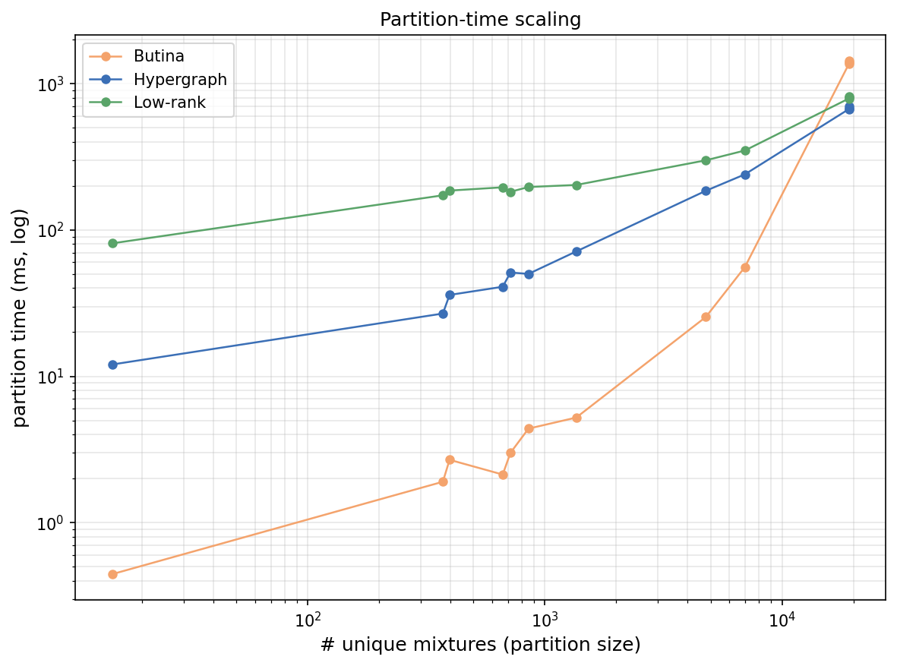

# CheMixHub chem-OOD splits via PALM's hypergraph + low-rank engines

Leakage-minimizing **chemical-similarity (chem-OOD)** train/val/test splits for all
9 CheMixHub datasets (12 dataset×property tasks), produced with PALM's two
splitting engines. This reproduces the MixUni chem-OOD *recipe*
(CheMixHub — Rajaonson et al., NeurIPS 2025; MixUni — ICML 2026 GFM workshop,
Appendix A.4 / Table 4) but swaps the paper's Butina + LPT-bin-packing partitioner
for PALM's leakage-minimizing partitioners:

| engine | how it partitions |
|---|---|
| `hypergraph` | k-NN similarity **hyperedges**, Mt-KaHyPar KM1 cut |
| `lowrank`    | Nyström factorization `S≈BBᵀ` + balanced-Lloyd + FM polish |

## What "matching the paper's split" means here

Featurization is **identical to the paper** (Table 4):

- per-component **Morgan fingerprint, radius 2, 1024 bits** from canonical SMILES;
- per-mixture fingerprint = **mole-fraction-weighted mean**, with salt components
  given a fixed pseudo-weight `w_salt = 0.5` (Eq. 13), then **binarized at 0.5**;
- samples **collapsed to unique mixture identity** = (sorted solvent set, sorted
  salt set); every `(T, c)` measurement of a mixture inherits its bucket;
- split fractions **0.70 / 0.20 / 0.10** (train / val / test), **seed 42**,
  Tanimoto similarity.

Only the *assignment step* differs. We produce **four** splits per task to make
that difference measurable:

- `random_sample` — the standard sample-level random 70/20/10 (seed 42). Not a
  chem-OOD split; kept only to reproduce the paper's **Table-16 leakage metric**
  (fraction of test samples whose mixture identity is already in train).
- `random_group` — whole unique mixtures assigned randomly (a fair 0-identity-leak
  baseline for L(π)).
- `butina` — **the paper's actual chem-OOD method**: Butina clustering at τ=0.4 +
  size-descending deficit-greedy LPT bin-packing by sample count.
- `hypergraph`, `lowrank` — **PALM's engines**, which cut whole unique mixtures
  under an objective that **directly minimizes L(π)** while balancing, rather than
  clustering-then-packing.

Because whole mixtures are assigned atomically, **mixture-identity leakage is 0.0**
for Butina *and* both PALM engines (the paper's Table-16 failure mode — up to
99.9% under the standard random split — is eliminated by construction). `L(π)`
then measures the *residual chemical-similarity* leakage between buckets, i.e. how
chemically similar the held-out mixtures still are to training.

## Results





**L(π)** = scaled cross-split Tanimoto leakage at the unique-mixture level, all
methods scored identically (`common/leakage_metrics.scaled_lpi`); lower is better.
`rand id-leak` reproduces the paper's Table 16.

| task | N | rand id-leak | rand-grp L | Butina L | hyper L | **lowrank L** |
|---|--:|--:|--:|--:|--:|--:|
| IL cond | 40,904 | 99.9% | 0.451 | 0.257 | 0.130 | **0.102** |
| IL visc | 75,992 | 99.9% | 0.464 | 0.313 | **0.060** | 0.176 |
| MS density | 30,061 | 46.7% | 0.460 | 0.277 | 0.348 | **0.201** |
| MS Hvap | 30,061 | 46.7% | 0.460 | 0.277 | 0.270 | **0.201** |
| MS Hmix | 30,061 | 46.7% | 0.460 | 0.277 | 0.353 | **0.201** |
| drug solub. | 27,166 | 100.0% | 0.465 | 0.491 | **0.210** | 0.235 |
| PE cond | 11,350 | 99.9% | 0.455 | 0.430 | 0.249 | **0.089** |
| olfactory | 865 | 0.0% | 0.463 | 0.338 | 0.380 | **0.233** |
| logV | 34,374 | 95.6% | 0.462 | 0.454 | 0.321 | **0.102** |
| NIST logV | 239,200 | 99.9% | 0.463 | 0.402 | 0.312 | **0.122** |
| MON | 684 | 50.0% | 0.459 | 0.552 | 0.274 | **0.182** |
| medicine | 251 | 100.0% | 0.533 | 0.000\* | 0.676 | **0.362** |

Takeaways:

- The standard random split leaks **95–100% mixture identity** on every
  high-redundancy electrolyte/viscosity task (k̄ ≫ 1), matching the paper's Table 16
  (their IL visc 99.9%, MS density 47.3% → ours 99.9% / 46.7%). All three
  whole-mixture splits drive that to **0%**.
- On residual chemical leakage L(π), **PALM beats the paper's own Butina split on
  11/12 tasks** — often ~2–4× lower (PE cond 0.089 vs 0.430; logV 0.102 vs 0.454).
  Butina only enforces a hard 0.6-similarity threshold; it does **not** minimize
  total cross-split similarity, so it can even exceed the random baseline (MON
  0.552 > 0.459). PALM's engines optimize L(π) directly.
- **`lowrank` is the best single method (9/12)**; `hypergraph` wins on the two
  highest-redundancy IL/drug tasks.
- \* `medicine` (15 unique mixtures) is degenerate: Butina collapses everything
  into **one cluster** → empty val/test (L=0 is meaningless); the PALM engines
  still return a usable split.

Full per-split numbers (per-bucket sample/mixture fractions, cluster counts,
imbalance, runtime) are in [`splits/leakage_report.csv`](splits/leakage_report.csv)
and [`splits/leakage_report.json`](splits/leakage_report.json); regenerate the
figures with `make_comparison_chart.py`.

## Relation to the paper's split (provenance)

The MixUni paper **documents the chem-OOD recipe in full** (Appendix A.4 +
Table 4 — reproduced here) but **does not ship the split indices**: "code,
configurations, and trained checkpoints will be released upon acceptance," and the
indices are "generated once and reused." So there is no public artifact to diff
against yet — this directory reconstructs the split from the documented recipe.

Two differences from the paper's exact setup, by design:
- **Scope.** The paper builds **one** chem-OOD split over the *unified 5-property*
  dataset (IL cond, IL visc, PE cond, NIST-logV, MS density) with per-component
  fingerprints shared across all five (~121k/35k/17k). We instead split **each of
  the 9 datasets / 12 tasks independently** (what the colleague asked for), so
  every task gets its own drop-in split.
- **Partitioner.** Butina+bin-packing → PALM's engines (the whole point).

The CheMixHub benchmark repo itself ships only `kfold`, `lso`, `num_components`,
and `temperature` splits (`SPLIT_MAPPING`) — **no Butina/chem-OOD split**; that
protocol is MixUni's own contribution. Our `butina_*` files are a faithful
re-implementation of it for a head-to-head baseline. If you want the paper's exact
*unified-5* split (shared fingerprints, single split) rather than per-dataset, it
is a small change to `make_chemixhub_splits.py` — say the word.

## Timing

Partition-time only (the shared featurization is excluded; warm, best-of-3 —
`benchmark_split_timing.py`, `timing_report.csv`):




At CheMixHub scales (≤ 19k unique mixtures) **all three partition in under 1.5 s**,
and the differences are milliseconds — dwarfed by the shared featurization, which
dominates wall-clock. The interesting part is the **scaling**:

- **Butina is O(n²)** in the number of unique mixtures (full Tanimoto matrix):
  cheapest at small n (< 5 ms below ~1k mixtures) but the steepest curve — it
  **crosses above both PALM engines around ~10k mixtures** and is the *slowest*
  at n = 19k (MS density: Butina 1.39 s vs hypergraph 0.67 s vs low-rank 0.80 s).
- **Low-rank is ~O(n·r)** and essentially **flat** (~0.1–0.8 s from n = 15 to
  19 157): it pays the highest fixed cost — Nyström factorization + 4 balanced-Lloyd
  restarts + FM polish — so on tiny problems it is the slowest in absolute ms, but
  that overhead is constant and it barely moves as n grows. This is the same
  O(n·r) behaviour that lets it scale to millions of rows elsewhere in PALM.
- **Hypergraph** sits between the two — low overhead, moderate (sub-quadratic)
  slope.

So the leakage win in the previous section comes with **no time penalty at scale**:
past ~10k mixtures the PALM engines are both lower-leakage *and* faster than the
paper's Butina split; below that, everything is sub-second anyway.

## Where the splits are

```
splits/<dataset>/<property>_splits/{random_group,butina,hypergraph,lowrank}_chemood_split.safetensors
```

48 split files (12 tasks × 4 saved splits) + the report. Each `.safetensors` holds
three int64 tensors — `train_indices`, `val_indices`, `test_indices` — of
**positional row indices into the property-filtered `processed_*.csv`**
(`df[df.property == prop].reset_index(drop=True)`), exactly the convention
CheMixHub's own `kfold_split_*.safetensors` / `SplitLoader` use. So they are
drop-in: point `SplitLoader` at, e.g.,
`splits/ionic-liquids/electrical_conductivity_splits/lowrank_chemood_split.safetensors`.

```python
from safetensors.numpy import load_file
d = load_file("splits/nist-logV/log_viscosity_splits/lowrank_chemood_split.safetensors")
train, val, test = d["train_indices"], d["val_indices"], d["test_indices"]
```

## Caveat — sample vs mixture balance

PALM's engines balance the **number of unique mixtures** per bucket (`node_weights
= 1`), whereas the paper's LPT bin-packing balances **sample count** and therefore
lands on ~exactly 70/20/10 samples (see `butina`'s `sample_fractions`, all 0.70 /
0.20 / 0.10). On high-redundancy tasks (`k̄ ≫ 1`, e.g. nist-logV, polymer-electrolyte)
the PALM engines' realized *sample* fractions drift from 70/20/10 (worst case
nist-logV/hypergraph ≈ 65/18/17); `lowrank`'s are generally closer. This is the one
axis on which Butina is currently ahead — and it is a pure plumbing gap, not an
algorithmic one: pinning sample fractions needs only a `node_weights` pass-through
in `splitters/common/mtkahypar_partition.py` and a weighted `target_sizes` in
`balanced_lloyd` (see [`../../splitters/docs/embedding_enrichment.md`](../../splitters/docs/embedding_enrichment.md)).
Once weighted, PALM keeps its large L(π) advantage *and* matches Butina's balance.

## Reproduce

```bash
git clone https://github.com/chemcognition-lab/chemixhub   # provides datasets/
CUDA_VISIBLE_DEVICES=<free gpu> LD_LIBRARY_PATH=/homes/rzhu/miniforge3/envs/palm/lib \
/homes/rzhu/miniforge3/envs/palm/bin/python make_chemixhub_splits.py \
    --data-root <clone>/datasets --out ./splits
```

Runtime: whole suite ≈ a few minutes on one GPU (featurization of the 520k rows
dominates; each engine cut is < 2 s because it runs on ≤ 19k unique mixtures).

### Per-dataset notes
- **ionic-liquids / polymer-electrolyte** use the `salt` flag in `compounds.csv`
  (salt weight 0.5, salts kept in the identity's salt set); other datasets have no
  salt and treat all components as solvent.
- **drug-solubility** (`cmp_ids_solvent` + `cmp_ids_drug`) and
  **olfactory-similarity** (`cmp_ids_1` + `cmp_ids_2`, no mole fractions → equal
  weights) are multi-column; identity is the union multiset of component sets.
